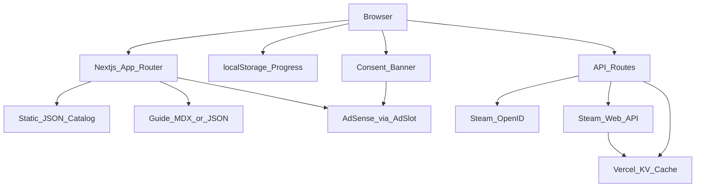
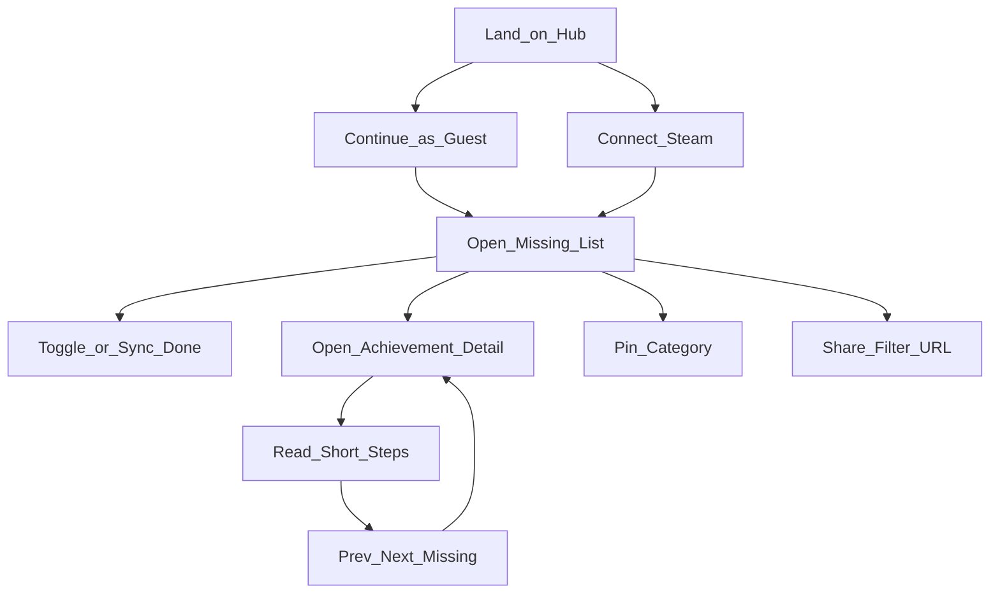

# Palpletion — MVP Product & Technical Plan

**Date:** 2026-07-13  
**Status:** Building / MVP UI shipped locally  
**Skills cited:** `palworld-tracker-product`, `tracker-ux`, `gaming-ad-monetization`, `reddit-launch`

---

## 1. Decisions locked

| Decision | Choice |
| --- | --- |
| Product name | **Palpletion** |
| Primary domain | **palpletion.com** (register ASAP; backups: `palpletion.app`, `getpalpletion.com`) |
| Language | English-first (RU later, not in MVP) |
| Analog | [Completionism](https://completionism.com/) product shape for Palworld |
| Stack | Next.js 15 App Router + TypeScript + Tailwind CSS 4 + Vercel |
| Progress v1 | `localStorage` guest progress (ship this week) |
| Progress v2 | Steam OpenID + Web API sync (immediately after MVP UI) |
| Accounts | No email/password accounts in MVP |
| Ads day 0 | `AdSlot` component + inventory IDs + placeholders; AdSense IDs when approved |
| Monetization ladder | AdSense → Ezoic-class → Playwire when eligible (`gaming-ad-monetization`) |
| Content | Versioned JSON catalog + hand-written short guides (no scraped Steam text) |
| Steam AppID | `1623730` |

---

## 2. Product one-liner

A fast, filter-first completion tracker for Palworld 1.0: show what you still need, how to get it, and sync progress from Steam — funded by ads without killing usability.  
(Source: `palworld-tracker-product`)

Primary job: *“What am I missing for 100%, and what’s the next easiest unlock?”*

---

## 3. MVP scope

### Ship in MVP

1. Full achievement catalog: icon, title, description, category, update pack tag, slug, spoiler flag, effort bucket, global-% placeholder.
2. Hub with overall progress %, **View missing** CTA, pinned categories (≤9), category browse.
3. List pages with filters: **Missing (default)** / All / Done; category chips; update pack; search. Filter state in URL query params.
4. Achievement detail: requirement, 3–7 numbered steps, region/boss/prereqs, prev/next missing, spoiler toggle for 1.0 story content.
5. Guest progress via `localStorage` (optimistic toggles).
6. Steam connect onboarding modal (Connect Steam **or** continue as guest) + FAQ accordion — UI in MVP; live sync in Phase 2.
7. `AdSlot` wired for all inventory placements with placeholders until AdSense live.
8. Privacy policy + basic cookie/consent gate stub (blocks non-essential ads until consent).
9. Mobile-first layout per `tracker-ux`; ads never block checkboxes.

### Explicitly defer

- Email/cloud accounts beyond Steam
- Full Paldex / breeding calculator
- Multi-game library
- AI chat guides
- Collectibles/boss paths not tied to achievements (post-MVP expansion lanes)
- Russian locale

---

## 4. Information architecture & routes

Matches `tracker-ux` IA (max 3 clicks hub → guide step):

| Route | Purpose |
| --- | --- |
| `/` | Hub: brand, progress, View missing / Connect Steam, pinned, categories |
| `/achievements` | Full list + filters (`?status=missing&category=&update=&q=`) |
| `/achievements/[slug]` | Detail + guide + prev/next missing |
| `/categories/[slug]` | Category-scoped list |
| `/updates/[slug]` | Achievements added in a patch (e.g. `1-0`, `feybreak`) |
| `/sync` | Steam connect / troubleshoot / last-synced |
| `/privacy` | Privacy policy |
| `/ads.txt` | Publisher ads.txt (static) |

No marketing landing page for Reddit launch — the hub *is* the product (`reddit-launch`).

---

## 5. Architecture





---

## 6. Data model

### Catalog (`data/catalog/achievements.v{N}.json`)

Versioned file committed to repo; bump `N` on schema changes. Build-time import into typed modules.

```ts
type UpdatePack = "base" | "sakurajima" | "feybreak" | "crossplay" | "terraria" | "1.0";

type Effort = "quick" | "grind" | "boss";

type Achievement = {
  id: string;              // Steam API name, e.g. "ACHIEVEMENT_CAPTURE_10"
  slug: string;            // URL slug
  name: string;
  description: string;     // Steam requirement text (short)
  icon: string;            // /icons/{id}.webp path
  iconGray: string;
  categorySlug: string;
  updatePack: UpdatePack;
  spoiler: boolean;        // 1.0 story / World Tree
  effort: Effort;
  regionHints: string[];
  prereqIds: string[];
  relatedBoss?: string;
  guideSteps: string[];    // 3–7 spoiler-safe steps; story steps gated by spoiler
  order: number;           // display sort within category
};
```

```ts
type Category = {
  slug: string;
  name: string;
  description: string;
  icon: string;
  order: number;
};
```

Categories (fixed for MVP): `catching`, `bosses`, `legendary-pals`, `raids`, `crafting`, `exploration`, `labor-research`, `misc`.

### Player progress (client)

```ts
type ProgressState = {
  version: 1;
  source: "local" | "steam" | "merged";
  steamId?: string;
  lastSyncedAt?: string; // ISO
  completed: Record<string, boolean>; // achievement id → done
  pinnedCategorySlugs: string[];      // max 9
  notes: Record<string, string>;      // never wiped by sync
};
```

**Merge rule:** Steam sync is source of truth for `completed` keys present in API response; local-only toggles for unknown/manual platforms kept; `notes` and pins never wiped (`tracker-ux`).

### Steam cache (server)

- Schema: cache `GetSchemaForGame` 24h in Vercel KV.
- Player achievements: cache 5 min TTL; refresh on demand from `/sync`.
- Never expose Web API key to the client.

---

## 7. Tech stack (greenfield defaults)

| Layer | Choice |
| --- | --- |
| Framework | Next.js 15 (App Router), React 19, TypeScript strict |
| Styling | Tailwind CSS 4 + CSS variables for brand tokens |
| Fonts | Display: **Outfit**; Body: **Source Sans 3** (via `next/font`) |
| Icons/images | Local WebP in `/public/icons`; lazy-load + fixed aspect for CLS |
| State | Zustand store hydrated from `localStorage` |
| Validation | Zod for catalog + API responses |
| Hosting | Vercel (static catalog SSR/SSG hybrid; API routes for Steam) |
| Cache | Vercel KV for Steam schema/player TTL |
| Analytics | Vercel Analytics + simple custom events (page depth, sync click) |
| Consent | Lightweight custom banner → gate AdSense |
| Lint/format | ESLint + Prettier; `pnpm` |
| Tests | Vitest for merge/filter helpers; Playwright smoke later |

**Rendering:** Catalog pages SSG/ISR; hub and lists client-hydrated for filters/progress; `/api/steam/*` dynamic.

---

## 8. Steam sync approach

1. User hits Connect Steam on `/` modal or `/sync`.
2. Server route starts Steam OpenID 2.0 (`https://steamcommunity.com/openid`).
3. Callback verifies assertion, extracts SteamID64, sets httpOnly session cookie.
4. Server calls `ISteamUserStats/GetPlayerAchievements/v1` with AppID `1623730` using server-only `STEAM_WEB_API_KEY`.
5. Map API `achievements[].name` → catalog `id`; return completed set to client.
6. Client merges into Zustand + `localStorage`; show **last synced** timestamp.
7. Errors surface in FAQ accordion: private profile, API down, empty schema — never silent fail.

**Env vars:** `STEAM_WEB_API_KEY`, `STEAM_REALM` (`https://palpletion.com`), `KV_*` for Vercel KV.

Xbox / PS5 / private profiles: guest manual toggles only (no fake Steam IDs).

---

## 9. Ad strategy from day 0 (no accounts yet)

Follow `gaming-ad-monetization` inventory exactly. Abstract everything behind `AdSlot`.

| Placement ID | Where |
| --- | --- |
| `leaderboard_top` | Hub below progress CTA (never in hero) |
| `incontent_1` | After 8–10 list rows |
| `sidebar_desktop` | Desktop category pages only |
| `incontent_detail` | Detail after guide steps 1–2 |
| `anchor_mobile` | Mobile sticky bottom, collapsible |
| `footer_board` | Pre-footer |

**Day 0 implementation:**

1. `components/ads/AdSlot.tsx` — props: `placementId`, `sizes`, `platform`.
2. `data/ads/inventory.ts` — single source of slot metadata.
3. `NEXT_PUBLIC_ADS_ENABLED=false` until AdSense approved → render muted placeholder boxes (same reserved sizes) so layout/CLS is real.
4. Consent banner required before loading ad script.
5. Ship `/ads.txt` with placeholder publisher line; replace when AdSense issues it.
6. Apply for AdSense after domain live + privacy policy + real content (not empty shell).
7. When approved: set publisher ID env, flip `ADS_ENABLED`, keep same placement IDs for future Playwire swap.

Hard rules: no ads in first-viewport hero; no ad between checkbox and label; max one sticky on mobile; cut an ad before cutting a filter.

---

## 10. Hosting & domains

1. Owner registers **palpletion.com** (Namecheap/Cloudflare Registrar/Porkbun — any).
2. Point DNS to Vercel project.
3. Preview deployments on every PR; production on `main`.
4. Env secrets in Vercel only (Steam key never in repo).
5. Until domain exists: develop on `*.vercel.app`; do **not** Reddit-launch on a coming-soon page.

---

## 11. Content pipeline

1. Pull Steam schema once via API (or public schema dump) → seed `achievements.v1.json` IDs/names/icons.
2. Map each achievement into a category + `updatePack` + `effort` manually in a spreadsheet → export JSON.
3. Download Steam icons → convert to WebP → `/public/icons`.
4. Write `guideSteps` original copy (3–7 steps); mark `spoiler: true` for 1.0 story/World Tree. Do **not** copy Steam guide text verbatim (`palworld-tracker-product` anti-goals).
5. Reference structure only: community 100% guides for coverage checks.
6. After patches: bump catalog version, tag new rows with update pack, add `/updates/[slug]` page, highlight on hub.

**MVP content bar for Reddit:** all known 1.0 achievements listed; guides for high-traffic/missing-heavy ones complete; remaining marked “guide WIP” rather than empty.

---

## 12. Brand & UX defaults

- Atmosphere: Palpagos island mood (teal/sand/dusk sky gradients + soft terrain texture) — original styling, no Pocketpair asset rip.
- Hub first viewport only: brand **Palpletion**, one progress %, one CTA group, one support line, dominant atmosphere (`tracker-ux` + frontend design rules).
- No card-heavy hero; no stat strips above the fold.
- Motion: progress bar fill-in, filter chip press, list row complete fade (2–3 intentional motions).
- Keyboard: `/` focuses search on list pages.

---

## 13. Reddit launch sequence

Per `reddit-launch` — post only when usable:

### Pre-flight

- [ ] Mobile Missing list + toggles work
- [ ] localStorage persists across refresh
- [ ] 1.0 achievements present or labeled WIP
- [ ] Privacy policy live
- [ ] Screenshots: Missing filter + one guide detail
- [ ] Read live sub rules day-of
- [ ] Account has karma/age

### Post angle (locked)

**1.0 missing checklist** — “Filterable Palworld 1.0 achievement checklist (Missing-only + short guides)”

Honest WIP: Steam sync shipping next / some guides incomplete.

### Sub order

1. r/achievement_hunters (or equivalent hunter sub) — utility first  
2. r/PalworldTips / guide-oriented Palworld subs  
3. r/Palworld only if rules allow tools; else helpful comments with link + mod ask  
4. Soft amplifiers same week: own Steam guide comment, Discord promo channels, short Missing-filter clip on X

### Aftercare

Reply to bugs within a day; ship visible fixes; collect guide corrections into content backlog.

---

## 14. Phased roadmap (order of work)

### Phase 0 — Foundations (Day 1)

- [ ] `pnpm create next-app` (App Router, TS, Tailwind, ESLint) in repo root
- [ ] Project structure: `app/`, `components/`, `data/`, `lib/`, `public/`
- [ ] Brand tokens + fonts + hub shell (no ads in hero)
- [ ] Zod types + empty catalog scaffold
- [ ] Zustand + `localStorage` progress hydrate
- [ ] `AdSlot` + `inventory.ts` + placeholders + consent stub
- [ ] `/privacy` draft

### Phase 1 — Tracker MVP UI (Days 2–4) ← Reddit-ready target

- [ ] Seed full achievement catalog + icons + categories + update packs
- [ ] Write guide steps for priority achievements; WIP labels elsewhere
- [ ] Hub: progress, View missing, pins, category list
- [ ] `/achievements` filters (Missing default) + URL sync + search
- [ ] `/categories/[slug]`, `/updates/[slug]`
- [ ] `/achievements/[slug]` detail + spoiler toggle + prev/next missing
- [ ] Optimistic checkbox toggles; empty-100% celebration state
- [ ] Wire all ad placement IDs (placeholders)
- [ ] Mobile QA: thumb-zone toggles + anchor placeholder
- [ ] Deploy to Vercel; share preview URL for owner smoke test

### Phase 2 — Steam sync (Days 5–7)

- [ ] Owner creates Steam Web API key + OpenID realm for domain
- [ ] `/api/auth/steam` + callback + session cookie
- [ ] `/api/steam/achievements` + KV cache
- [ ] Merge logic + last-synced UI + FAQ accordion
- [ ] `/sync` troubleshoot page
- [ ] Analytics events: sync_start, sync_success, sync_fail

### Phase 3 — Domain, ads, launch (Days 7–10)

- [ ] Register **palpletion.com**; DNS → Vercel
- [ ] Apply AdSense (or equivalent); keep placeholders until approved
- [ ] Finalize `ads.txt` + consent → real ads when live
- [ ] Reddit pre-flight checklist; post with locked angle
- [ ] Aftercare loop: fix guides from comments within 48h

### Phase 4 — Depth & revenue (post-launch)

- [ ] Recommended path (ease / region clustering)
- [ ] Collectibles tied to achievements
- [ ] Patch changelog → new achievement highlight on hub
- [ ] Revisit network ladder when traffic qualifies (Ezoic → Playwire)
- [ ] Optional RU locale if demand appears

---

## 15. Owner actions (blocked on human)

1. Register **palpletion.com** (or approve backup).
2. Create Vercel account / link GitHub repo.
3. Create Steam Web API key (for Phase 2).
4. Apply Google AdSense after Phase 1 content is live on the real domain.
5. Approve this plan → start Phase 0 build.

---

## 16. Success metrics (MVP window)

| Metric | Target |
| --- | --- |
| Time-to-Missing | &lt;10s, no login |
| Session depth | ≥3 pageviews (hub → list/category → detail) |
| Steam connect rate | Track from Phase 2; optimize FAQ if &lt;15% of Steam visitors |
| Ad health | Impressions/session up without bounce spike; CLS budget intact |
| Launch | Constructive Reddit feedback + ≥1 data correction incorporated |

---

## 17. Repo layout (target)

```
app/
  (tracker)/page.tsx
  achievements/page.tsx
  achievements/[slug]/page.tsx
  categories/[slug]/page.tsx
  updates/[slug]/page.tsx
  sync/page.tsx
  privacy/page.tsx
  api/auth/steam/route.ts
  api/steam/achievements/route.ts
  ads.txt/route.ts
components/
  hub/
  achievements/
  ads/AdSlot.tsx
  sync/
  consent/
data/
  catalog/achievements.v1.json
  catalog/categories.json
  ads/inventory.ts
lib/
  progress/
  steam/
  filters/
public/icons/
```

---

*End of plan. No app code in this document — implement only after owner approval.*
